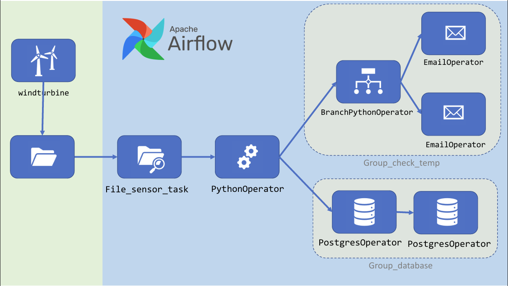

# Windturbine (Airflow Project)

Este projeto foi desenvolvido no curso de Airflow da [Udemy](https://www.udemy.com.br), lecionado pelo professor [Fernando Amaral](https://www.linkedin.com/in/fernando-amaral/).

## Objetivo

O objetivo deste projeto é pôr em prática os conceitos aprendidos no curso e explorar a funcionalidade de file sensor do Airflow, que consiste em verificar a existência de um arquivo e, assim, iniciar o pipeline.

## O que é o Airflow?

Apache Airflow é uma plataforma de código aberto para desenvolvimento, agendamento e monitoramento de fluxos de trabalho em batch. A estrutura extensível do Airflow em Python permite que você crie fluxos de trabalho conectando-se com praticamente qualquer tecnologia. Uma interface da Web ajuda a gerenciar o estado de seus fluxos de trabalho. O Airflow pode ser implantado de várias maneiras, desde um único processo em seu laptop até uma configuração distribuída para suportar os maiores fluxos de trabalho.

## Cenário (Original)

Imagine que você é um(a) engenheiro(a) de dados que deseja fazer a ingestão e monitoramento de dados de uma turbina de vento. Sabe-se que, a cada 5 minutos, a turbina exporta um arquivo JSON neste formato:

```json
{
  "powerfactor": "0.7744647042667024",
  "hydraulicpressure": "71.5191975857507",
  "temperature": "22.26467848208289",
  "timestamp": "2024-07-14 19:40:16.450057",
  "idtemp": "1",
  "name": "json_windturbine"
}
```

Para fins de simulação, a nossa turbina será representada por um arquivo Python que gera esses arquivos JSON. Nosso objetivo é fazer a extração deste arquivo toda vez que ele é criado, armazená-lo no banco de dados e enviar um email informando se a temperatura está normal (<24) ou alterada (>=24).



## Cenário (Modificado)

Como forma de praticar meus conhecimentos em criação de DAGs e em Python, alterei o cenário para incluir três turbinas de vento, cada uma exportando registros em formatos de arquivo diferentes. O pipeline será configurado para ler os três arquivos e processá-los em uma única DAG com três fluxos distintos.

Formatos de Arquivos
Turbina 1: JSON
Turbina 2: CSV
Turbina 3: PARQUET
Cada turbina exporta os dados a cada 5 minutos, e o objetivo do pipeline é:

Detectar a criação de cada arquivo.
Processar e armazenar os dados no banco de dados.
Enviar um email informando o status da temperatura (normal ou alterada) para cada turbina.
Esta configuração permite explorar a flexibilidade do Airflow em lidar com diferentes formatos de dados e consolidar múltiplos fluxos de trabalho em uma única DAG.


## Alterações no Escopo do Projeto
Para simplificar a execução e melhorar a organização do projeto, foram feitas as seguintes alterações:

1. **Inserção de um Dockerfile:** Optei por usar uma imagem mais limpa do Airflow, garantindo um ambiente mais controlado e eficiente.
2. **Criação de um arquivo `requirements.txt:`** Este arquivo lista os pacotes Python mínimos necessários para a execução do docker-compose, garantindo que todas as dependências sejam instaladas de forma automatizada.
3. **Criação de uma arquivo `variables.json`:** Este arquivo contém as variáveis necessárias para a execução da DAG de forma mais simples e centralizada, facilitando a configuração e manutenção do projeto.
4. **Criação de um arquivo .env:**  Este arquivo armazena as variáveis SMTP do Airflow, permitindo uma configuração mais segura e flexível do ambiente.

Essas alterações visam tornar o projeto mais simples de executar, garantindo que todos os componentes necessários estejam bem definidos e organizados.

## Tecnologias Usadas
### Apache Airflow
- **Descrição:** Plataforma de código aberto para desenvolvimento, agendamento e monitoramento de fluxos de trabalho em batch.
- **Uso no Projeto:** Orquestração dos pipelines de dados, monitoramento e execução das DAGs.

### Python
- **Descrição:** Linguagem de programação de alto nível, interpretada e de propósito geral.
- **Uso no Projeto:** Desenvolvimento de scripts para simulação de geração de dados das turbinas e para as tarefas dentro das DAGs.

### Docker
- **Descrição:** Plataforma de contêineres que permite empacotar, distribuir e gerenciar aplicativos e suas dependências em contêineres isolados.
- **Uso no Projeto:** Criação de um ambiente de execução isolado e consistente para o Airflow utilizando um Dockerfile personalizado.

### Docker Compose
- **Descrição:** Ferramenta para definir e gerenciar aplicativos Docker multi-contêiner.
- **Uso no Projeto:** Orquestração dos serviços necessários para o ambiente de Airflow, incluindo webserver, scheduler e banco de dados.

### JSON, CSV e XML
- **Descrição:** Formatos de dados usados para armazenamento e intercâmbio de informações.
- **Uso no Projeto:** Representação dos dados exportados pelas turbinas de vento.

### PostgreSQL
- **Descrição:** Sistema de gerenciamento de banco de dados relacional de código aberto.
- **Uso no Projeto:** Armazenamento dos dados extraídos das turbinas de vento.

### Email (SMTP)
- **Descrição:** Protocolo para envio de emails.
- **Uso no Projeto:** Envio de notificações sobre o status da temperatura das turbinas de vento.

## Arquivos de Configuração

### Dockerfile
- **Descrição:** Arquivo de script utilizado pelo Docker para criar uma imagem de contêiner personalizada.
- **Uso no Projeto:** Definição de uma imagem Airflow mais limpa e customizada para o projeto.

### requirements.txt
- **Descrição:** Arquivo que lista os pacotes Python necessários para a execução do projeto.
- **Uso no Projeto:** Instalação automatizada das dependências necessárias para o `docker-compose`.

### variables
- **Descrição:** Arquivo contendo variáveis necessárias para a execução das DAGs de forma simplificada.
- **Uso no Projeto:** Centralização e simplificação da configuração das variáveis de ambiente do Airflow.

### .env
- **Descrição:** Arquivo que armazena variáveis de ambiente de forma segura.
- **Uso no Projeto:** Configuração das variáveis SMTP do Airflow.